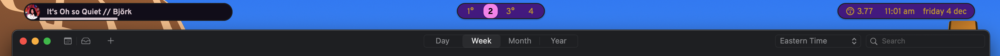

# kneebar

Candified fork of [nibar](https://github.com/kkga/nibar/).

(the widget on the top left is [ueberplayer](https://github.com/aCluelessDanny/UeberPlayer))


## Installation

Clone this repo to your Übersicht widgets directory.

```bash
# assuming your widgets are in the default Übersicht location
$ git clone https://github.com/kkga/nibar $HOME/Library/Application\ Support/Übersicht/widgets/nibar
```

## Dependencies

- [Overpass](http://overpassfont.org) is the font that I use in the screenshot
- [SF Symbols](https://developer.apple.com/sf-symbols/) (optional) — used for symbols in the statusbar widget

## Usage

### Refreshing yabai workspaces widget

The workspaces widget is not refreshing automatically (to preserve battery). Add these lines at the end of your `yabairc` to utilize [yabai's signals](https://github.com/koekeishiya/yabai/wiki/Commands#automation-with-rules-and-signals) for auto-updating the widget whenever a workspace is changed:

```sh
yabai -m signal --add event=space_changed \
    action="osascript -e 'tell application \"Übersicht\" to refresh widget id \"nibar-spaces-jsx\"'"

# if using multple displays, add an additional rule for "display_changed" event
yabai -m signal --add event=display_changed \
    action="osascript -e 'tell application \"Übersicht\" to refresh widget id \"nibar-spaces-jsx\"'"
```

```sh
# add these rules to auto-update the "windows" widget
yabai -m signal --add event=window_focused \
    action="osascript -e 'tell application \"Übersicht\" to refresh widget id \"nibar-windows-jsx\"'"
yabai -m signal --add event=window_destroyed \
    action="osascript -e 'tell application \"Übersicht\" to refresh widget id \"nibar-windows-jsx\"'"
yabai -m signal --add event=window_created \
    action="osascript -e 'tell application \"Übersicht\" to refresh widget id \"nibar-windows-jsx\"'"
yabai -m signal --add event=space_changed \
    action="osascript -e 'tell application \"Übersicht\" to refresh widget id \"nibar-windows-jsx\"'"
```
